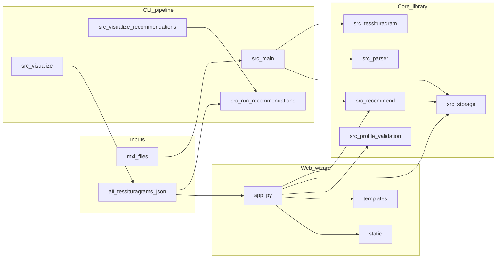
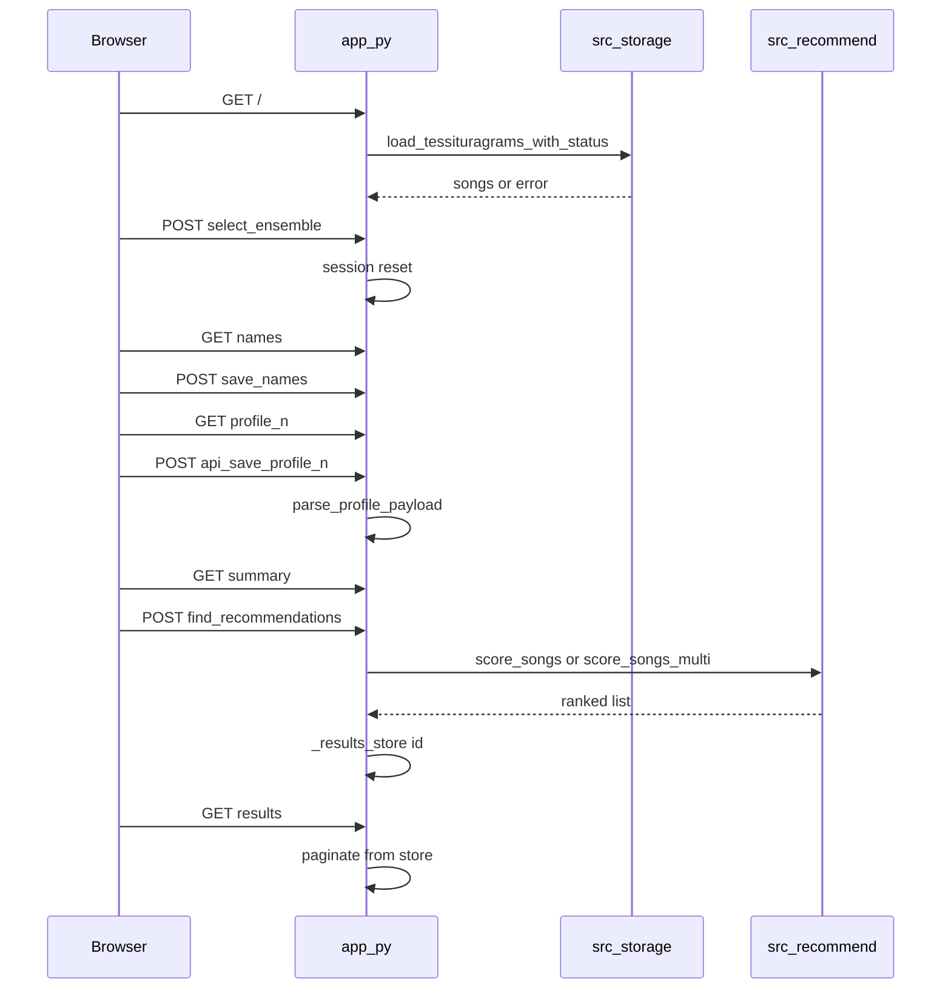

# Architecture and system guide

This document explains how the **Tessituragram Repertoire Recommender** repository fits together: data flow, the recommendation engine, the Flask web wizard, how files interact, and how **Docker** runs the same app in a controlled environment.

For licensing and dataset contracts, see [DATA.md](DATA.md). For spec-driven laws and stories, see [spec/constitution.md](spec/constitution.md) and [spec/user-stories.md](spec/user-stories.md).

---

## 1. High-level system map

Two main ways to use the project share the same **JSON libraries** and **`src.recommend`** scoring logic:

- **CLI** — build tessituragrams from `.mxl`, run interactive recommendations, emit notebooks.
- **Web (Flask)** — browser wizard: ensemble → names → vocal profiles (piano UI) → ranked results.



---

## 2. Recommendation pipeline (end to end)

### 2.1 Building tessituragrams (CLI)

1. **`python -m src.main`** ([`src/main.py`](../src/main.py)) reads `.mxl` files from `songs/mxl_songs/` (or `--input-dir` / `--file`).
2. **[`src/parser.py`](../src/parser.py)** — `extract_vocal_line` uses **music21** to parse MusicXML, pick vocal part(s) (lyrics / highest voice / fallback), and return a flat list of `Note` and `Rest` objects.
3. **[`src/metadata.py`](../src/metadata.py)** — `extract_metadata` reads composer/title from the score or filename patterns.
4. **[`src/tessituragram.py`](../src/tessituragram.py)** — `generate_tessituragram` sums **quarterLength** per **MIDI pitch** (string keys) to form a duration-weighted histogram. `calculate_statistics` derives range and related stats.
5. **[`src/storage.py`](../src/storage.py)** — `merge_songs` + `save_tessituragrams` writes **`data/tessituragrams.json`** (flat solo-shaped records by default from this path).

The **web app** expects the **multi-part** library **`data/all_tessituragrams.json`** (see [DATA.md](DATA.md)); CLI output in `tessituragrams.json` is a different default file unless you merge or convert.

### 2.2 Vocal profile (web and CLI concept)

A **profile** is:

- `min_midi`, `max_midi` — comfortable range (MIDI 21–108 enforced in web API).
- `favorite_midis`, `avoid_midis` — optional lists inside that range.
- `alpha` — weight on “avoid” penalty (0–1).

Web: JSON from the piano UI is validated by **`parse_profile_payload`** in [`src/profile_validation.py`](../src/profile_validation.py) on `POST /api/save-profile/<index>`.

### 2.3 Scoring and ranking ([`src/recommend.py`](../src/recommend.py))

**Vectorisation**

- `build_dense_vector` — sparse tessituragram dict → dense `numpy` array over a MIDI span.
- `normalize_l1` — song vector as **fraction of singing time** per pitch.
- `build_ideal_vector` — baseline + boosts at favorites, cuts at avoids, clipped non-negative, then **`normalize_l2`** for cosine similarity with the song vector.

**Solo (`num_parts == 1`)**

1. `filter_by_ensemble_type` keeps songs whose part count matches the session.
2. `flatten_song_part(song, 0)` turns the first part into the legacy flat shape.
3. `filter_by_range` drops songs whose pitch range is not **fully inside** the singer’s range.
4. `score_songs` — for each song: cosine similarity between L1-normalised tessituragram and ideal vector; **avoid_penalty** = mass on avoid pitches; **final_score** = `cosine_similarity - alpha * avoid_penalty`; sort by `final_score` then filename; attach **`_explain_solo`** text.

**Ensemble (`num_parts > 1`)**

1. Same library filter by part count.
2. For each song, `find_optimal_assignment`:
   - `build_feasibility_matrix` — profile *i* can cover part *j* only if the part’s MIDI range fits inside the profile’s range.
   - `has_valid_assignment` — Hungarian algorithm (`scipy.optimize.linear_sum_assignment`) on feasibility (infeasible = huge cost).
   - Score matrix: for each feasible pair, `score_profile_vs_part` (same cosine / avoid / alpha idea on that part’s tessituragram).
   - Second Hungarian pass on **negated** scores to **maximise** total assignment score.
3. `score_songs_multi` ranks songs by **average** per-part score; **`_explain_multi`** summarises the assignment.

**CLI alignment** — [`src/run_recommendations.py`](../src/run_recommendations.py) uses the same `filter_by_range`, `build_ideal_vector`, `score_songs`, and `score_songs_multi` when given the same library and profiles (see [spec/plan.md](spec/plan.md) Epic B).

---

## 3. Web request flow (Flask)

Session keys (cookie-backed): `num_parts`, `ensemble_label`, `singer_names`, `profiles`, `result_id`, plus counts for results pagination context.

In-memory (process-local, **lost on restart**): `_results_store`, `_charts_store` keyed by UUID from `find_recommendations`.



Route summary (see [`app.py`](../app.py)):

| Route | Role |
|--------|------|
| `GET /` | Load library; ensemble type picker; 503 + `library_unavailable.html` if missing/invalid |
| `POST /select-ensemble` | Store `num_parts`, reset `profiles` / names |
| `GET /names`, `POST /save-names` | Singer labels |
| `GET /profile/<index>` | Piano wizard page |
| `POST /api/save-profile/<index>` | JSON profile → session; **400** + `{ok, error}` on validation failure |
| `GET /summary` | Review all profiles |
| `POST /find-recommendations` | Run engine; redirect to `/results` |
| `GET /results` | Paginated table + charts data |

---

## 4. Repository layout (file-by-file)

### 4.1 Root

| File | Role |
|------|------|
| [`app.py`](../app.py) | Flask application: routes, session, in-memory result stores, `get_library_path()` |
| [`requirements.txt`](../requirements.txt) | All dependencies including **pytest** (local dev / CI). NumPy/SciPy pins support **Python 3.13** wheels (Docker + Linux). |
| [`requirements-prod.txt`](../requirements-prod.txt) | Runtime deps + **gunicorn** only; used by Docker **`prod`** stage. |
| [`Dockerfile`](../Dockerfile) | Multi-stage image: **`prod`** then **`dev`** (default `docker build`). |
| [`.dockerignore`](../.dockerignore) | Keeps build context small; **excludes `data/`** so the image stays portable. |
| [`docker-compose.yml`](../docker-compose.yml) | `web` (dev) and `web-prod` (profile `prod`): port map, `./data` read-only mount, health check. |
| [`.env.example`](../.env.example) | Documents env vars; copy to `.env` for Compose variable substitution (optional). |
| [`README.md`](../README.md) | Quick start: native Python, Docker, CLI, tests. |

### 4.2 [`src/`](../src/)

| Module | Role |
|--------|------|
| `__init__.py` | Package marker |
| `main.py` | CLI: `.mxl` → tessituragram JSON |
| `parser.py` | music21-based vocal line extraction |
| `tessituragram.py` | Histogram + statistics |
| `metadata.py` | Composer/title |
| `storage.py` | JSON load/save, ensemble discovery, flattening multi-part songs, recommendations I/O |
| `recommend.py` | Filtering, vectors, solo/multi scoring, explanations |
| `run_recommendations.py` | Interactive terminal recommender |
| `profile_validation.py` | Shared profile JSON validation for API + tests |
| `visualize.py` | Builds `tessituragrams.ipynb` from library JSON |
| `visualize_recommendations.py` | Builds notebook from `recommendations.json` |

### 4.3 [`templates/`](../templates/)

| Template | Role |
|----------|------|
| `base.html` | Layout, fonts, CSS link |
| `index.html` | Ensemble picker |
| `names.html` | Singer names |
| `profile.html` | Piano profile UI shell + JSON config for JS |
| `summary.html` | Pre-run review |
| `results.html` | Ranked results + pagination |
| `library_unavailable.html` | Friendly 503 when data is missing or invalid |

### 4.4 [`static/`](../static/)

| Path | Role |
|------|------|
| `css/style.css` | App styling |
| `js/piano.js` | Piano keyboard behaviour |
| `js/profile-page.js` | Save profile via `fetch`, handle errors |
| `js/results.js` | Results page behaviour |

### 4.5 [`tests/`](../tests/)

| File | Role |
|------|------|
| `conftest.py` | Adds project root to `sys.path` for `import app` |
| `test_profile_validation.py` | `parse_profile_payload` edge cases |
| `test_app_routes.py` | Flask `test_client`: `/` with temp library, invalid save-profile → 400 |

### 4.6 [`data/`](../data/)

Canonical description: [DATA.md](DATA.md). Short summary:

| Artifact | Typical role |
|----------|----------------|
| `all_tessituragrams.json` | Primary **multi-part** library for **web** and full CLI multi-part runs |
| `tessituragrams.json` | Default **CLI build** output from `src.main` |
| `recommendations.json` | Default **CLI recommender** output |

### 4.7 [`docs/`](../docs/) (spec and process)

| Path | Role |
|------|------|
| `README.md` | Spec workflow index |
| `ARCHITECTURE.md` | This file |
| `DATA.md` | Dataset layout and reproducibility |
| `tasks.md` | Granular backlog (incl. Docker tasks T-P01–T-P04) |
| `spec/` | Constitution, user stories, plan |
| `testing/manual-test.md` | Human QA checklist |
| `research/` | Clarifying Q&A |

### 4.8 [`how_tos/`](../how_tos/)

Step-by-step text guides for tessituragram creation, recommendations, and notebooks.

---

## 5. Data layout and environment variables

- **`TESSITURAGRAM_LIBRARY_PATH`** — optional override for the library file path (see `get_library_path()` in `app.py`).
- **`SECRET_KEY`** — Flask session signing; required for any non-trivial deployment (see constitution §2).
- **`PORT`**, **`FLASK_HOST`**, **`FLASK_DEBUG`** — passed through to `app.run()` in `app.py`. Docker sets `FLASK_HOST=0.0.0.0` so the server accepts traffic from outside the container namespace.

---

## 6. Containerization (how and why)

### 6.1 Goals

- **Reproducible** runtime on Python **3.13** with pinned scientific stack.
- **Do not bake** large or sensitive **`data/`** into the image; mount it at run time.
- **Non-root** user inside the container (`uid 1000`, name `app`).
- **Dev** image: same as `python app.py` locally. **Prod** image: **Gunicorn** WSGI.

### 6.2 `Dockerfile` walkthrough

| Section | What it does |
|---------|----------------|
| `# syntax=docker/dockerfile:1` | Enables modern Dockerfile features (optional but good practice). |
| `FROM python:3.13-slim AS base` | Small Debian-based Python image; shared base for both targets. |
| `ENV PYTHONDONTWRITEBYTECODE=1 …` | Fewer `.pyc` writes; log streaming; smaller pip cache in layers. |
| `WORKDIR /app` | Application root inside the container (matches relative paths like `data/…`). |
| `RUN useradd … app` | Non-privileged user for runtime. |
| **`AS prod`** | Installs **`requirements-prod.txt`** (no pytest), copies app, `chown`, `USER app`, **`CMD gunicorn`** binding `0.0.0.0:5000`, **2 workers × 2 threads**. |
| **`AS dev`** (final stage) | Installs **`requirements.txt`** (includes pytest), same copy/chown, **`CMD python app.py`**. |

**Why is `dev` last?** Docker uses the **last** stage as the default for `docker build` with no `--target`. That keeps `docker build -t tessituragram-app .` aligned with local development.

**`docker build --target prod -t tessituragram-app:prod .`** builds only the production stage graph needed for `prod`.

### 6.3 `.dockerignore`

Excludes `.git`, virtualenvs, caches, **`data/`**, **`songs/`**, **`docs/`**, **`tests/`**, notebooks, and IDE junk. Effects:

- Faster builds and smaller context.
- **Forces** you to provide `data/` via **bind mount** or volume — appropriate for large JSON that may not live in git.

### 6.4 Bind mount and port mapping

```text
host:./data  --mount-->  container:/app/data
host:5000   <--map-->   container:5000 (Flask/Gunicorn listens on 0.0.0.0:5000)
```

- **`-v "${PWD}/data:/app/data"`** (PowerShell: `` `-v "${PWD}/data:/app/data"` ``) overlays your real `data/` onto `/app/data`. The app’s default path `data/all_tessituragrams.json` resolves correctly.
- **`-p 5000:5000`** publishes container port 5000 to the host.

### 6.5 `docker-compose.yml`

- **`web`** — builds **`target: dev`**, mounts **`./data:/app/data:ro`**, maps **`${PORT:-5000}:5000`**.
- **`environment`** — `SECRET_KEY`, `FLASK_DEBUG`, `TESSITURAGRAM_LIBRARY_PATH` interpolated from the host environment or a **`.env`** file in the project directory (Compose reads `.env` for variable substitution automatically).
- **`healthcheck`** — `python -c "urllib.request.urlopen('http://127.0.0.1:5000/')"` proves the process responds (HTTP **200** or **503** both mean “server up”).
- **`web-prod`** — profile **`prod`**: **`docker compose --profile prod up --build`** for the Gunicorn image.

### 6.6 Python stack note (NumPy / SciPy)

Older pins (`numpy==1.26.4` on Linux) had **no cp313 wheels** and tried to compile from source inside `slim` (no compiler). The repo uses **NumPy 2.2.x / SciPy 1.15.x / matplotlib 3.10.x** with **manylinux** wheels for Python 3.13, matching [constitution](spec/constitution.md) and Docker.

---

## 7. Run modes cheat sheet

| Mode | Command | Notes |
|------|---------|--------|
| Native venv | `pip install -r requirements.txt` then `python app.py` | Debug on by default locally (`FLASK_DEBUG` unset). |
| Docker (plain) | `docker build -t tessituragram-app .` then `docker run … -v ./data:/app/data` | Default image = **dev** stage. |
| Compose (dev) | `docker compose up --build` | Read-only data mount; optional `.env` for secrets. |
| Compose (prod profile) | `docker compose --profile prod up --build` | Gunicorn `web-prod` service. |

---

## 8. When something breaks

- [README.md § Troubleshooting](../README.md#troubleshooting)
- [testing/manual-test.md](testing/manual-test.md)
- Missing library → **503** + `library_unavailable.html` (not a raw 500)
- `docker compose` health check failing → inspect logs: `docker compose logs web`

---

*Last updated with Docker multi-stage (`dev` / `prod`), Compose, and architecture documentation.*
