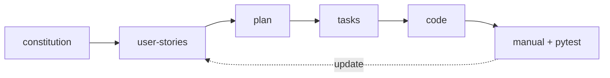

# Documentation — spec-driven development

This `docs/` tree is a **specification package**: laws first, then capabilities, implementation plan, work breakdown, and verification. **Implementers** start at [`spec/constitution.md`](spec/constitution.md); do not ship code that breaks **Laws** without updating the spec in the same change set.

---

## Folder layout

```text
docs/
├── README.md                 ← you are here: index and workflow
├── spec/                     core product spec (read in order 1 → 2 → 3)
│   ├── README.md
│   ├── constitution.md        laws: you must / you must not
│   ├── user-stories.md       user must be able to + acceptance criteria
│   └── plan.md               epics A–G → code, data, risks
├── tasks.md                  granular backlog (T-… IDs)
├── testing/
│   ├── README.md
│   └── manual-test.md         human verification after implementation
├── research/
│   ├── README.md
│   └── clarifying-questions.md
├── EPIC_PLAN.md              legacy pointer → use spec/plan.md
└── DATA.md                    dataset layout and provenance (teaching / thesis)
```

---

## Workflow (recommended)

| # | Document | Model hint (convention) |
|---|----------|-------------------------|
| 1 | [`spec/constitution.md`](spec/constitution.md) | **Opus-class** (or similar) for policy and laws |
| 2 | [`spec/user-stories.md`](spec/user-stories.md) | same — acceptance and traceability |
| 3 | [`spec/plan.md`](spec/plan.md) | **coding model** for accuracy against repo |
| 4 | [`tasks.md`](tasks.md) | **coding model** for concrete tasks |
| 5 | *repository code* | **coding / implement** |
| 6 | [`testing/manual-test.md`](testing/manual-test.md) | human QA; then **pytest** when G exists |
| 7 | Update checkboxes in [`spec/user-stories.md`](spec/user-stories.md) | — |

**Support:** raw Q&A lives in [`research/clarifying-questions.md`](research/clarifying-questions.md); **decisions** are summarized in `spec/constitution.md` § 6.

---

## Closing the loop



*When implementation changes, update the documents upstream of that change.*

---

## First-time read order

1. [`spec/constitution.md`](spec/constitution.md)  
2. [`spec/user-stories.md`](spec/user-stories.md)  
3. [`spec/plan.md`](spec/plan.md)  
4. [`tasks.md`](tasks.md)  
5. [`testing/manual-test.md`](testing/manual-test.md)  

## Legacy filenames

- **[`EPIC_PLAN.md`](EPIC_PLAN.md)** — redirect only; the technical map is **[`spec/plan.md`](spec/plan.md)**.
